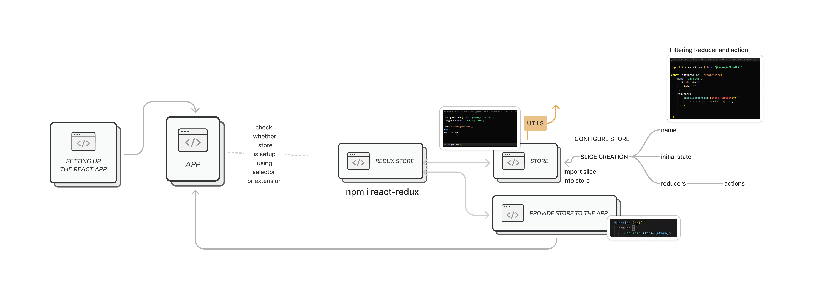

# Candidate Application Platform
## Overview
This a User-friendly Candidate Application Platform that allows user to view job listings, and filter jobs.

## Redux for Data Management

## Local setup
Prerequisites
1) npm (version 6.14.0 or later)
2) Yarn (optional, but recommended for better dependency management)

## Installation
1) Clone the Repository
First, clone the repository to your local machine

`git clone https://github.com/your-repository-url.git`
`cd your-repository-name`

## Install Dependencies
2) Navigate to the project directory and install the required dependencies using npm

`npm install`

## Start the Development Server
3) To start the development server and run the application in development mode, use one of the following commands:
`npm start`

This command starts the development server and opens the application in your default web browser. By default, the application runs on `http://localhost:3000`.

## Building for Production
When you're ready to prepare the application for deployment, you can create a production build using:
`npm run build`

